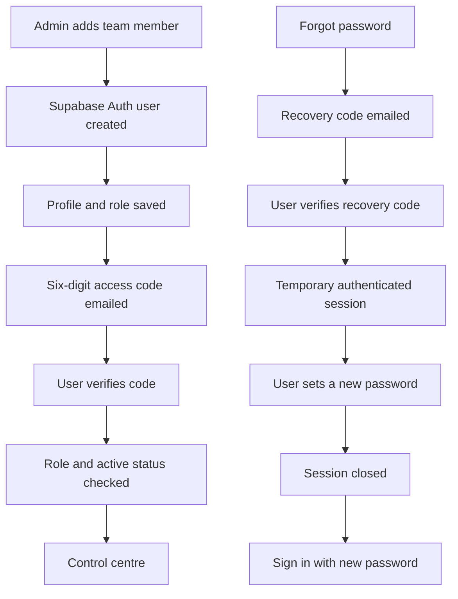

# Modtech control centre authentication

## User flows



The browser never creates public accounts. Team members are created by an administrator or sales
manager. The application server confirms that the account exists and is active before generating a
code with Supabase Admin Auth. Brevo's HTTP API delivers the code, while Supabase remains the system
that generates and verifies it.

## Timing

- OTP and recovery-code validity: 3,600 seconds (60 minutes).
- Resend cooldown: 60 seconds per email address and flow, enforced atomically in the database.
- A code is single-use. Requesting a replacement makes the previous code unsuitable for use.
- The UI countdown uses `VITE_AUTH_OTP_EXPIRY_SECONDS` and `VITE_AUTH_OTP_RESEND_SECONDS`. Keep
  these values equal to the Supabase expiry and application rate-limit settings.

## Supabase dashboard settings

In **Authentication > Sign In / Providers > Email**:

1. Enable email authentication.
2. Set **Email OTP expiration** to `3600` seconds.
3. Keep public application sign-up disabled if the project exposes no other registration flow.

In **Authentication > URL Configuration**:

1. Set the production Site URL to `https://www.modtechworld.com`.
2. Add production and intentional preview/development origins to the redirect allow list.

Supabase SMTP is not required by these application flows. `BREVO_API_KEY` is server-only, and the
server sends mail through Brevo's transactional HTTP API. The two files under `docs/supabase-*-template.html`
are fallback templates for emails sent directly from the Supabase dashboard; the application does
not use them.

## Application behavior

### Team invitation

1. An administrator can add any role. A sales manager can add sales executives only.
2. The server creates a confirmed Supabase Auth user, profile and role.
3. Supabase generates a six-digit email OTP and the application server sends the Modtech invitation
   through Brevo.
4. The user enters the code on `/auth`; RLS and the route guard verify role and active status.

### OTP sign-in

1. The app server checks the existing active profile, rate-limits the request, and asks Supabase to
   generate an OTP.
2. The app server sends the code through Brevo without exposing credentials to the browser.
3. The user enters the six-digit code within 60 minutes.
4. Supabase creates a session only after successful verification.
5. Users without an allowed role, or users whose profile is inactive, are signed out.

### Password recovery

1. The app server checks the existing active profile and asks Supabase to generate a recovery OTP.
2. Brevo sends the Modtech password recovery email.
3. The code is verified with OTP type `recovery`.
4. The user creates a password of at least 12 characters containing a letter and a number.
5. Supabase hashes and stores the password. The temporary recovery session is closed.
6. The user signs in again with the new password.

Supabase intentionally does not reveal whether a recovery email belongs to an existing account.
This prevents account enumeration.

## Environment

```text
VITE_SUPABASE_URL=
VITE_SUPABASE_PUBLISHABLE_KEY=
VITE_AUTH_OTP_EXPIRY_SECONDS=3600
VITE_AUTH_OTP_RESEND_SECONDS=60

SUPABASE_URL=
SUPABASE_PUBLISHABLE_KEY=
SUPABASE_SERVICE_ROLE_KEY=
BREVO_API_KEY=
```

Only variables prefixed with `VITE_` are sent to the browser. Never expose the service-role key.

Local demo authentication is enabled only when both `VITE_DEMO_ADMIN_EMAIL` and
`VITE_DEMO_ADMIN_PASSWORD` are present. Without both values, local development uses real Supabase
Auth so the complete flow can be tested before deployment.
